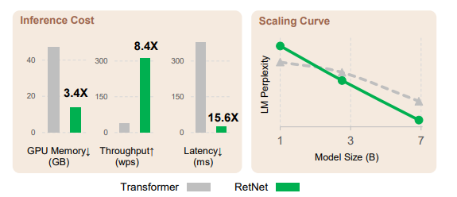

# retnet-torch
Strongly typed sub 200-line implementation of the Paper "Retentive Network: A Successor to Transformer for Large Language Models" in Pytorch. https://arxiv.org/pdf/2307.08621.pdf
<p align="left"> </p>

**NOTE:** Currenty the repo is experimental

## ToDo
- [ ] Better How to use section
- [ ] Better README
- [ ] Unittests
- [ ] Refactor parts of retnet.py

## How to install
Git:
```bash
git clone https://github.com/juvi21/retnet-torch.git
```
PyPi:
```bash
pip install retnet-torch
```
## How to use
**SEE:** [demo.ipynb](demo.ipynb)
```python
import torch
from retnet_torch.ret_net import CausalRetNet

# Initialize model
model = CausalRetNet(dim=24, vocab_size=8, num_layers=6, num_heads=6, dropout=0.5)

# Forward pass
sample_tensor = torch.randint(0, 8, (1, 10))
print(sample_tensor)
output = model(sample_tensor)
print(output)

# Stateful forward pass
sample_tensor2 = torch.randint(0, 8, (1, 10))
output2, state = model(sample_tensor2, need_state=True)
print(output2)
```
## Citations
```
@misc{sun2023retentive,
      title={Retentive Network: A Successor to Transformer for Large Language Models}, 
      author={Yutao Sun and Li Dong and Shaohan Huang and Shuming Ma and Yuqing Xia and Jilong Xue and Jianyong Wang and Furu Wei},
      year={2023},
      eprint={2307.08621},
      archivePrefix={arXiv},
      primaryClass={cs.CL}
}
```
## License:
This project is licensed under the MIT License.
